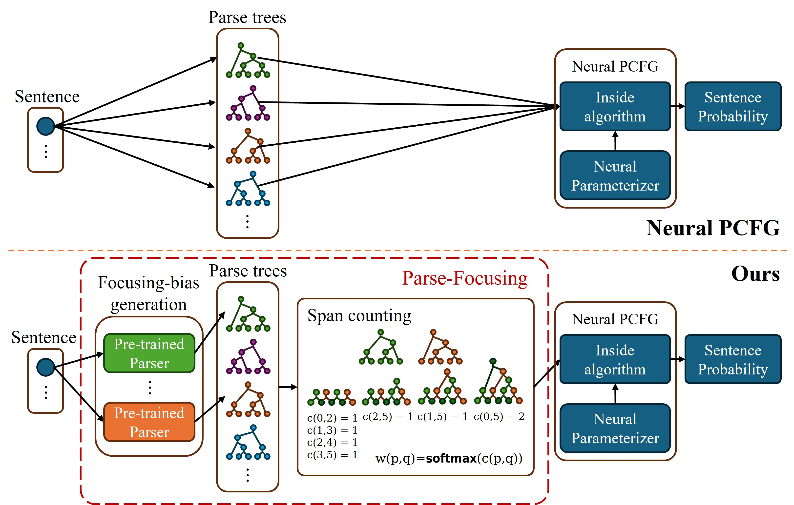

# Parse-focused Neural PCFG

Source code of ACL2024 Findings [Structural Optimization Ambiguity and Simplicity Bias in Unsupervised Neural Grammar Induction](https://arxiv.org/abs/2407.16181).
Our code is based on the [TN-PCFG](https://github.com/sustcsonglin/TN-PCFG).

## Overview



## Setup

### Prepare environment 

```bash
conda create -n swpf python=3.11
conda activate swpf
pip install -r requirements.txt
```

### Prepare dataset

We use three datasets PTB, CTB, SPMRL.

If you need to download the datasets, please refer to [TN-PCFG](https://github.com/sustcsonglin/TN-PCFG).

If you want to reproduce model yourself, download the datasets to local directory `data/raw` and follow the procedures below.

> [!IMPORTANT]
> To preprocess the datasets, the each dataset file has the formatted name such as `[prefix]-train.txt`.


```bash
python -m preprocessing.preprocessing \
--dir data/raw \
--save_dir data/english \
--prefix english
```

### (Optional) Generating dataset for baseline

Build new dataset that composed with generated parse trees. \[`right-branched` / `left-brancehd` / `random` / `right-binarized` / `left-binarized`\] parse trees are generated for each sentence in the given dataset.

```bash
python -m preprocessing.generate_focused_parse \
--factor [right-binarized/left-binarized/random/right-branched/left-branched] \
--vocab [path_to_vocab] \
--input [path_to_dataset] \
--output [path_to_save]
```

If you want to generate datasets for all languages, factors, and splits (train, valid, test):

```bash
./generate_focused_parse.sh
```

You can include or exclude options for languages, factors and splits in the script.

## Train

### (Optional) Prepare parse trees from pre-trained parsers

Our model uses three sets of parse trees parsed by three different parsers (Structformer, NBL-PCFG, FGG-TNPCFG).

If you want to train the `Parse-Focused TN-PCFG` using the pre-trained parsers we use, you can download them [here](https://1drv.ms/f/s!AkEpgY1bYqmLlIsO-H38Xf4IZzf7tg?e=G4iA4O).

To follow the instructions for training with our configuration, place the files in the `pretrained/` directory.

### (Optional) Prepare pre-trained model

> [!NOTE]
> You can evaluate pre-trained model without pre-trained parsers.

You can download our pre-trained model from [here](https://1drv.ms/f/s!AkEpgY1bYqmLlIsPmZW4SVHBskt3Fg?e=ssikxV).
You can evaluate the performance of the model without any training.

### Train Parse-focused TN-PCFG

**FGG-TNPCFG**
```bash
python train.py \
--conf config/ftnpcfg_eng_nt30_t60.yaml
```

**Parse-focused TN-PCFG**

```bash
python train.py \
--conf config/pftnpcfg_eng_nt30_t60.yaml
```

After training, the path to the save directory is printed. It may be downloaded at `log/pftnpcfg_eng_nt30_t60/PFTNPCFG[datetime]`.

## Evaluation

You can use a model that you download from us or trained by yourself for `path_to_log_dir`. 

```bash
python evaluate.py \
--load_from_dir [path_to_log_dir]
```
The CSV file with the results is saved in parent directory of `path_to_log_dir`. For instance, `log/pftnpcfg_eng_nt30_t60/pftnpcfg_eng_nt30_t60.csv`.

This CSV file has the following format:

```csv
save dir, sentence-level F1, corpus-level F1, likelihood, perplexity
```

## Paring

> [!CAUTION]
> If you use a large grammar model (almost larger than NT 300 / T 600), Viterbi parsing may not work due to out-of-memory issues.

> [!NOTE]
> MBR decoding does not predict constituent symbol labels.
> For detailed analysis accroding to symbol labels, it is better to use Viterbi than MBR.

```bash
python parse.py \
--load_from_dir [path_to_log_dir] \
--dataset data/raw/english-test.txt \
--decode_type viterbi \
--output parsed/pftnpcfg_eng_nt30_t60_test.txt \
```

## Out-of-memory

If you encounter OOM, you should adjust the batch size in the YAML file.

For GPUs with 12GB memory, the following batch sizes are available for each grammar size:

* FTN-PCFGs
    * NT=4500 / T=9000: ~16
    * NT=30 / T=60: ~64

## Post-processing

### String to Tree

Transform parse trees in string format to NLTK Trees and save to file.

```bash
python -m postprocessing.string_to_tree \
--filepath parsed/pftnpcfg_eng_nt30_t60_test.txt \
--vocab [path_to_log_dir]/word_vocab.pkl \
--output nltk_tree/pftnpcfg_eng_nt30_t60_test.pkl
```

### String to Span

Transform parse trees in string format to spans and save to file.

```bash
python -m postprocessing.string_to_span \
--filepath parsed/pftnpcfg_eng_nt30_t60_test.txt \
--vocab [path_to_log_dir]/word_vocab.pkl \
--output span_tree/pftnpcfg_eng_nt30_t60_test.pkl
```

## Analysis

### Correlation between F1 and NLL

Each CSV Files should have the following format:

```
f1 score, likelihood
f1 score, likelihood
...
```

If you want to get a CSV file from evaluation CSV file, use the command below.

```bash
awk -F "," '{ print $2, $4 }' log/pftnpcfg_eng_nt30_t60/pftnpcfg_eng_nt30_t60.csv > pftnpcfg_results.csv
```

`scatter_with_hist.py`: `Fig. 2(a)` Visualization for correlation between F1 and LL for single model with histogram.

```bash
python -m analyzer.correlation.scatter_with_hist \
--filepath pftnpcfg_results.csv
```

`scatter_comparison.py`: `Fig. 2(b)` Visualization for correlation between F1 and LL for various models.

```bash
python -m analyzer.correlation.scatter_comparision \
--filepath pftnpcfg_results.csv ftnpcfg_results.csv \
--label PFTNPCFG FTNPCFG
```

### Trees

> [!WARNING]
> Some analyzing tools below are not completely work.
> It will be corrected soon.

`compare_trees.py`: `Tab. 1` Calculate F1 score and IoU score for given parse trees.

`rule_frequency.py`: `Fig. 5` Visualize sorted distribution for frequencies that observed rules in parse trees.

`common_uncommon_hist.py`: `Fig. 9` Visualize the degree of rareness for rules and the accuracy according to the degree of rareness.

### The number of Unique rules

Visualize the number of unique rules for each sentence length.

#### For single model in figure. (`Fig. 3(a)`) 

```bash
python3 -m analyzer.unique_rules \
--input "[CSV file path]" \
--output "[Target output file]"
```

#### For different models in same figure. (`Fig. 3(b)`)

Use same command with `Fig. 3(a)`, but CSV file have to involve `group id` column to distinguish each group.

#### For each language in different sub-figures. (`Fig. 7`)

The column `group id` represent as subtitle of figure.
The following `tick_size`, `legend_size`, `label_size` is recommended for this figure.

```bash
python3 -m analyzer.unique_rules \
--input "[CSV file path]" \
--output "[Target output file path]" \
--split_by_group \
--n_col 5 \
--n_row 2 \
--tick_size 17 \
--legend_size 17 \
--label_size 30
```

### Performance

Visualize the performance according to the combination of multi-parsers.

#### For absolute performance (`Fig. 10`)

```bash
python3 -m analyzer.homo_hetero \
--input "[CSV file path]" \
--output "[output file path]" \
```

#### For difference between pre-trained parsers and trained models (`Fig. 6`)

```bash
python3 -m analyzer.homo_hetero \
--input "[CSV file path]" \
--output "[output file path]" \
--difference
```

## Contact

If you have any questions, please remains in `issues` or contact to me (jinwookpark2296@gmail.com).